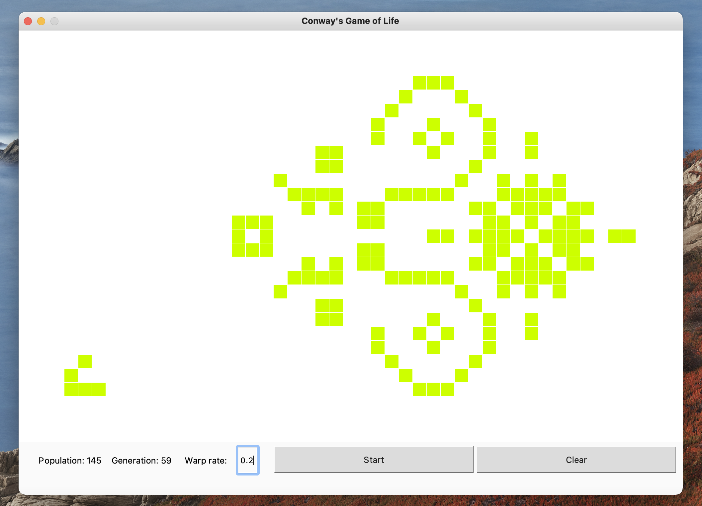

# The-Game-Of-Life

A Python implementation of John Conway's Game of Life I created back in 2018 while learning Python.

This simulation allows you to create an initial pattern and run it on a 47x31 game field.

The generation and current population of the game world are displayed underneath the field.
